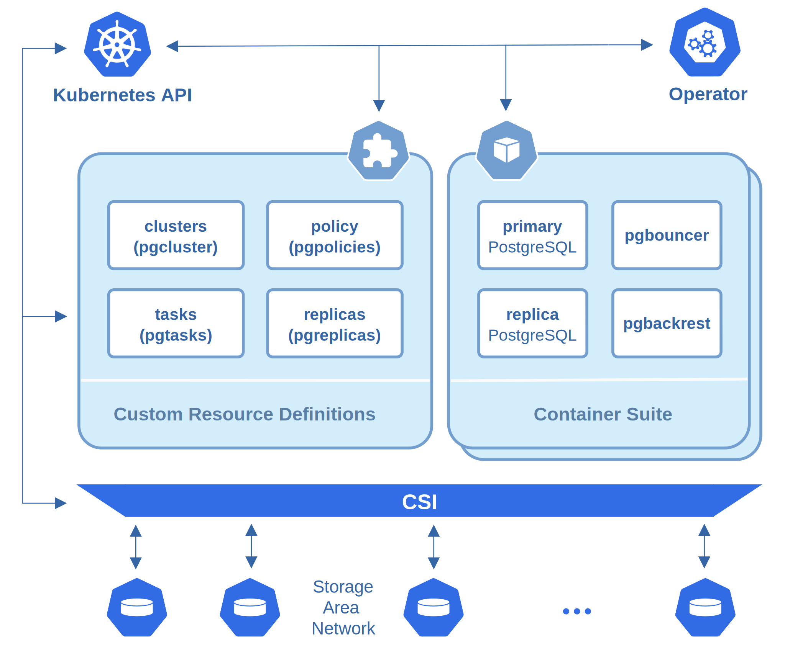

# Percona Operator for PostgreSQL

[](https://opensource.org/licenses/Apache-2.0)

## Introduction

Percona Operator for PostgreSQL automates and simplifies deploying and managing open source PostgreSQL clusters on Kubernetes. Percona Operator for PostgreSQL is based on [Postgres Operator](https://crunchydata.github.io/postgres-operator/latest/) developed by Crunchy Data.

Whether you need to get a simple PostgreSQL cluster up and running, need to deploy a high availability, fault tolerant cluster in production, or are running your own database-as-a-service, the Operator provides the essential features you need to keep your clusters healthy:

* **PostgreSQL Cluster Provisioning**

    Create, Scale, & Delete PostgreSQL clusters with ease, while fully customizing your Pods and PostgreSQL configuration.

* **High Availability**

    Safe, automated failover backed by a distributed consensus based high-availability solution. Uses Pod Anti-Affinity to help resiliency; you can configure how much enforced this can be. Failed primaries automatically heal, allowing for faster recovery time. Support for standby PostgreSQL clusters that work both within and across multiple Kubernetes clusters.

* **Disaster Recovery**

    Backups and restores leverage the open source pgBackRest utility and includes support for full, incremental, and differential backups as well as efficient delta restores. Set how long you want your backups retained for. Works great with very large databases!

* **Communication Security**

    Secure communication between your applications and data servers by enabling TLS for your PostgreSQL servers, including the ability to enforce all of your connections to use TLS.

* **Monitoring**

    Track the health of your PostgreSQL clusters with Percona Monitoring and Management (PMM).

* **PostgreSQL User Management**

    Quickly add and remove users from your PostgreSQL clusters with powerful commands. Manage password expiration policies or use your preferred PostgreSQL authentication scheme.

* **Updates Management**

    Safely apply PostgreSQL updates with minimal availability impact to your PostgreSQL clusters.

* **Advanced Replication Support**

    Choose between asynchronous replication and synchronous replication for workloads that are sensitive to losing transactions.

* **Clone**

    Create new clusters from your existing clusters or backups.

* **Connection Pooling**

    Use [pgBouncer](https://access.crunchydata.com/documentation/postgres-operator/latest/tutorial/pgbouncer/) for connection pooling

* **Affinity and Tolerations**

    Have your PostgreSQL clusters deployed to Kubernetes Nodes of your preference with node affinity, or designate which nodes Kubernetes can schedule PostgreSQL instances to with Kubernetes  tolerations.

* **Scheduled Backups**

    Choose the type of backup (full, incremental, differential) and how frequently you want it to occur on each PostgreSQL cluster.

* **Backup to S3**

    Store your backups in Amazon S3 or any object storage system that supports the S3 protocol. The Operator can backup, restore, and create new clusters from these backups.

* **Multi-Namespace Support**

    You can control how the Operator leverages Kubernetes Namespaces with several different deployment models:

    * Deploy the Operator and all PostgreSQL clusters to the same namespace
    * Deploy the Operator to one Namespace, and all PostgreSQL clusters to a different Namespace
    * Deploy the Operator to one Namespace, and have your PostgreSQL clusters managed across multiple Namespaces

* **Full Customizability**

    The Operator not only makes it easy to get PostgreSQL up and running on Kubernetes-enabled platforms, but also allows you to further customize your deployments, including:

    * Selecting different storage classes for your primary, replica, and backup storage
    * Select your own container resources class for each PostgreSQL cluster deployment; differentiate between resources applied for primary and replica clusters
    * Use your own container image repository, including `imagePullSecrets` and private repositories  support
    * Customize your PostgreSQL configuration
    * Bring your own trusted certificate authority (CA) for use with the Operator API server
    * Override your PostgreSQL configuration for each cluster
    * Use your own custom images, re-define the image for each container separately

## Deployment Requirements

The Operator is validated for deployment on Kubernetes, GKE and EKS clusters. The Operator is cloud native and storage agnostic, working with a wide variety of storage classes, hostPath, and NFS.

The Operator includes various components that get deployed to your Kubernetes cluster as shown in the following diagram and detailed in the Design section of the documentation for the version you are running.

### Supported Platforms

The following platforms were tested and are officially supported by the Operator 1.2.0:

* Google Kubernetes Engine (GKE) 1.17 - 1.21
* Amazon Elastic Container Service for Kubernetes (EKS) 1.21
* OpenShift 4.6 - 4.8

Other Kubernetes platforms may also work but have not been tested.

### Storage

The Operator is tested with a variety of different types of Kubernetes storage and Storage Classes, as well as hostPath and NFS.
The variety of different Storage Classes available for Kubernetes is too wide to verify the Operator functionality in each one. With that said, the Operator is designed to be storage class agnostic and has been demonstrated to work with additional Storage Classes.

## Quickstart installation

### Helm

Install the Operator:

```sh
helm install my-operator percona/pg-operator
```

Install Percona Distribution for PostgreSQL:

```sh
helm install my-db percona/pg-db 
```

See more details in:
- [Helm installation documentation](https://www.percona.com/doc/kubernetes-operator-for-postgresql/helm.html)
- [Operator helm chart parameter reference](https://github.com/percona/percona-helm-charts/blob/main/charts/pg-operator)
- [Percona Distribution for PostgreSQL helm chart parameters reference](https://github.com/percona/percona-helm-charts/blob/main/charts/pg-db)

### kubectl

Quickly making the Operator up and running with cloud native PostgreSQL includes two main steps:

Deploy the operator from `deploy/operator.yaml`

```sh
kubectl create namespace pgo
kubectl -n pgo apply -f https://raw.githubusercontent.com/percona/percona-postgresql-operator/main/deploy/operator.yaml
```
Deploy the database cluster itself from `deploy/cr.yaml`

```sh
kubectl -n pgo apply -f https://raw.githubusercontent.com/percona/percona-postgresql-operator/main/deploy/cr.yaml
```

See full installation instructions with examples and various advanced cases on [percona.com](https://www.percona.com/doc/kubernetes-operator-for-postgresql/index.html#installation-guide).

## Design overview



PostgreSQL containers deployed with Percona Operator for PostgreSQL include the following components:

* [PostgreSQL](https://www.postgresql.org/)
  * [PostgreSQL Contrib Modules](https://www.postgresql.org/docs/current/contrib.html)
  * [pgAudit](https://www.pgaudit.org/)
  * [set_user](https://github.com/pgaudit/set_user)
  * [wal2json](https://github.com/eulerto/wal2json)
* [pgBackRest](https://pgbackrest.org/)
* [pgBouncer](http://pgbouncer.github.io/)
* [Patroni](https://patroni.readthedocs.io/)
* [pg_stat_monitor](https://github.com/percona/pg_stat_monitor/)
* LLVM (for JIT compilation)

Percona Operator for PostgreSQL Monitoring involves the following components:

* [pmm-server](https://www.percona.com/doc/percona-monitoring-and-management/2.x/details/architecture.html#pmm-server)
* [pmm-client](https://www.percona.com/doc/percona-monitoring-and-management/2.x/details/architecture.html#pmm-client)

## Contributing to the Project

Percona welcomes and encourages community contributions to help improve Percona Kubernetes Operators as well as other Percona's projects.
See the [Contribution Guide](CONTRIBUTING.md) for more information.

## Submitting Bug Reports

If you find a bug related to the Operator, please submit a report to the project's [Jira](https://jira.percona.com/projects/K8SPG/issues) issue tracker.

Learn more about submitting bugs, new feature ideas, and improvements in the [Contribution Guide](CONTRIBUTING.md).
