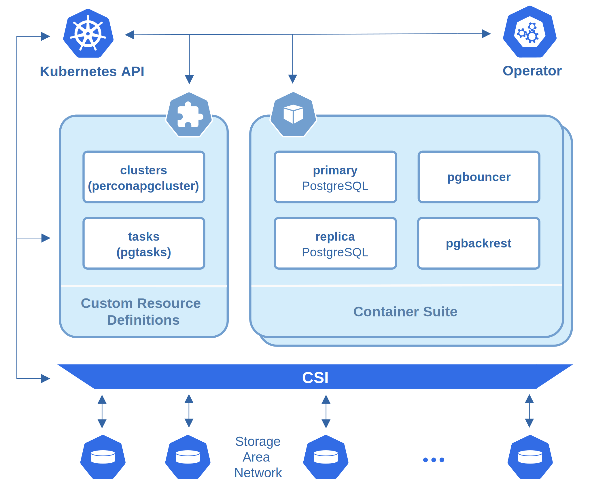
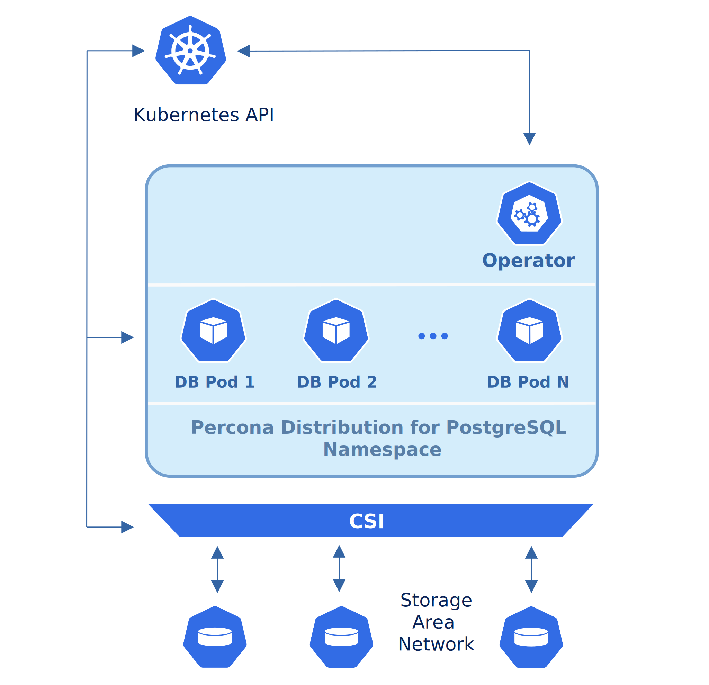

Design overview
===============

The |operator| automates and simplifies
deploying and managing open source PostgreSQL clusters on Kubernetes.
The Operator is based on `CrunchyData's PostgreSQL Operator <https://crunchydata.github.io/postgres-operator/latest/>`_.

PostgreSQL containers deployed with the Operator include the following components:

* The `PostgreSQL <https://www.postgresql.org/>`_ database management system, including:

  * `PostgreSQL Additional Supplied Modules <https://www.postgresql.org/docs/current/contrib.html>`_,
  * `pgAudit <https://www.pgaudit.org/>`_ PostgreSQL auditing extension,
  * `PostgreSQL set_user Extension Module <https://github.com/pgaudit/set_user>`_,
  * `wal2json output plugin <https://github.com/eulerto/wal2json>`_,

* The `pgBackRest <https://pgbackrest.org/>`_ Backup & Restore utility,
* The `pgBouncer <http://pgbouncer.github.io/>`__ connection pooler for PostgreSQL,
* The PostgreSQL high-availability implementation based on the `Patroni template <https://patroni.readthedocs.io/>`_,
* the `pg_stat_monitor <https://github.com/percona/pg_stat_monitor/>`_ PostgreSQL Query Performance Monitoring utility,
* LLVM (for JIT compilation).

To provide high availability the Operator involves `node affinity <https://kubernetes.io/docs/concepts/configuration/assign-pod-node/#affinity-and-anti-affinity>`_
to run PostgreSQL Cluster instances on separate worker nodes if possible. If
some node fails, the Pod with it is automatically re-created on another node.

To provide data storage for stateful applications, Kubernetes uses
Persistent Volumes. A *PersistentVolumeClaim* (PVC) is used to implement
the automatic storage provisioning to pods. If a failure occurs, the
Container Storage Interface (CSI) should be able to re-mount storage on
a different node.

The Operator functionality extends the Kubernetes API with `Custom Resources
Definitions <https://kubernetes.io/docs/concepts/extend-kubernetes/api-extension/custom-resources/#customresourcedefinitions>`_.
These CRDs provide extensions to the Kubernetes API, and, in the case of the
Operator, allow you to perform actions such as creating a PostgreSQL Cluster,
updating PostgreSQL Cluster resource allocations, adding additional utilities to
a PostgreSQL cluster, e.g. `pgBouncer <https://www.pgbouncer.org/>`__ for
connection pooling and more.

When a new Custom Resource is created or an existing one undergoes some changes
or deletion, the Operator automatically creates/changes/deletes all needed
Kubernetes objects with the appropriate settings to provide a proper Percona
PostgreSQL Cluster operation.

Following CRDs are created while the Operator installation:

* ``pgclusters`` stores information required to manage a PostgreSQL cluster.
  This includes things like the cluster name, what storage and resource classes
  to use, which version of PostgreSQL to run, information about how to maintain
  a high-availability cluster, etc.
* ``pgreplicas`` stores information required to manage the replicas within a
  PostgreSQL cluster. This includes things like the number of replicas, what
  storage and resource classes to use, special affinity rules, etc.
* ``pgtasks`` is a general purpose CRD that accepts a type of task that is
  needed to run against a cluster (e.g. take a backup) and tracks the state of
  said task through its workflow.

