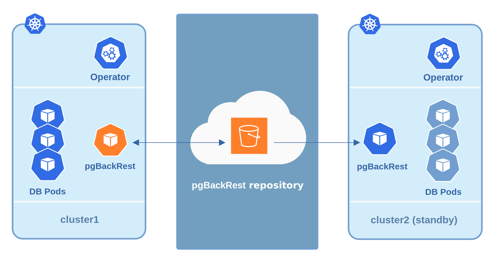
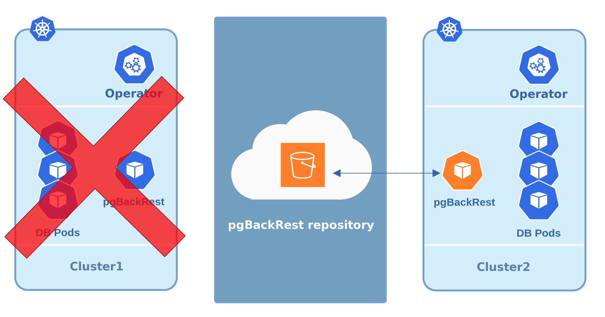

.. _howto_standby:

How to deploy a standby cluster for Disaster Recovery
====================================================================================

Deployment of a `standby PostgreSQL cluster <https://www.postgresql.org/docs/12/warm-standby.html>`_
is mainly targeted for Disaster Recovery (DR), though it can also be used for
migrations.

In both cases, it involves using some :ref:`object storage system for backups<backups>`,
such as AWS S3 or GCP Cloud Storage, which the standby cluster can access:

* there is a *primary cluster* with configured ``pgbackrest`` tool, which pushes
  the write-ahead log (WAL) archives :ref:`to the correct remote repository<backups.pgbackrest.repository>`,
* the *standby cluster* is built from one of these backups, and it is kept in
  sync with the *primary cluster* by consuming the WAL files copied from the
  remote repository.

.. note:: The primary node in the *standby cluster* is
   **not a streaming replica** from any of the nodes in the *primary cluster*.
   It relies only on WAL archives to replicate events. For this reason, this
   approach cannot be used as a High Availability solution.

Creating such a standby cluster involves the following steps:

* Copy needed passwords from the *primary cluster* Secrets and adjust them to
  use the *standby cluster* name. The following commands save the secrets
  files from ``cluster1`` under ``/tmp/copied-secrets`` directory and prepare
  them to be used in ``cluster2``:

  .. note:: Make sure you have the `yq tool installed <https://github.com/mikefarah/yq/#install>`_
     in your system.

.. code:: bash

   $ mkdir -p /tmp/copied-secrets/
   $ export primary_cluster_name=cluster1
   $ export standby_cluster_name=cluster2
   $ export secrets="${primary_cluster_name}-users"
   $ kubectl get secret/$secrets -o yaml \
   yq eval 'del(.metadata.creationTimestamp)' - \
   yq eval 'del(.metadata.uid)' - \
   yq eval 'del(.metadata.selfLink)' - \
   yq eval 'del(.metadata.resourceVersion)' - \
   yq eval 'del(.metadata.namespace)' - \
   yq eval 'del(.metadata.annotations."kubectl.kubernetes.io/last-applied-configuration")' - \
   yq eval '.metadata.name = "'"${secrets/$primary_cluster_name/$standby_cluster_name}"'"' - \
   yq eval '.metadata.labels.pg-cluster = "'"${standby_cluster_name}"'"' - \
   >/tmp/copied-secrets/${secrets/$primary_cluster_name/$standby_cluster_name}

* Create the Operator in the Kubernetes environment for the *standby cluster*,
  if not done:

  .. code:: bash 

     $ kubectl apply -f deploy/operator.yaml

* Apply the Adjusted Kubernetes Secrets:

  .. code:: bash 

     $ export standby_cluster_name=cluster2
     $ kubectl create -f /tmp/copied-secrets/${standby_cluster_name}-users

* Set the :ref:`backup.repoPath<backup-repopath>` option in the
  ``deploy/cr.yaml`` file of your *standby cluster* to the actual place where
  the *primary cluster* stores backups. If this option is not set in
  ``deploy/cr.yaml`` of your *primary cluster*, then the following default
  naming is used: ``/backrestrepo/<primary-cluster-name>-backrest-shared-repo``.
  For example, in case of ``myPrimaryCluster`` and ``myStandbyCluster``
  clusters, it should look as follows:

  .. code:: yaml

     ...
       name: myStandbyCluster
     ...
       backup:
         ...
         repoPath: "/backrestrepo/myPrimaryCluster-backrest-shared-repo"

* Supply your *standby cluster* with the Kubernetes Secret used by pgBackRest of
  the *primary cluster* to Access the Storage Bucket. The name of this Secret is
  ``<cluster-name>-backrest-repo-config``, and its content depends on the cloud
  used for backups (refer to the Operator's :ref:`backups documentation<backups>`
  for this step). The contents of the Secret needs to be the same for both
  *primary* and *standby* clusters except for the name: e.g.
  ``cluster1-backrest-repo-config`` should be recreated as
  ``cluster2-backrest-repo-config``.

* Enable the standby option in your *standby cluster's* ``deploy/cr.yaml`` file:

  .. code:: yaml

     standby: true

When you have applied your new cluster configuration with the usual
``kubectl -f deploy/cr.yaml`` command, it starts the synchronization via
pgBackRest, and your Disaster Recovery preparations are over.

When you need to actually use your new cluster, get it out from standby mode,
changing the standby option in your ``deploy/cr.yaml`` file:

  .. code:: yaml

     standby: false

Please take into account, that your ``cluster1`` cluster should not exist at the
moment when you get out your ``cluster2`` from standby:

.. note:: If ``cluster1`` still exists for some reason,
   **make sure it can not connect** to backup storage. Otherwise, both
   clusters sending WAL archives to it would cause data corruption!
