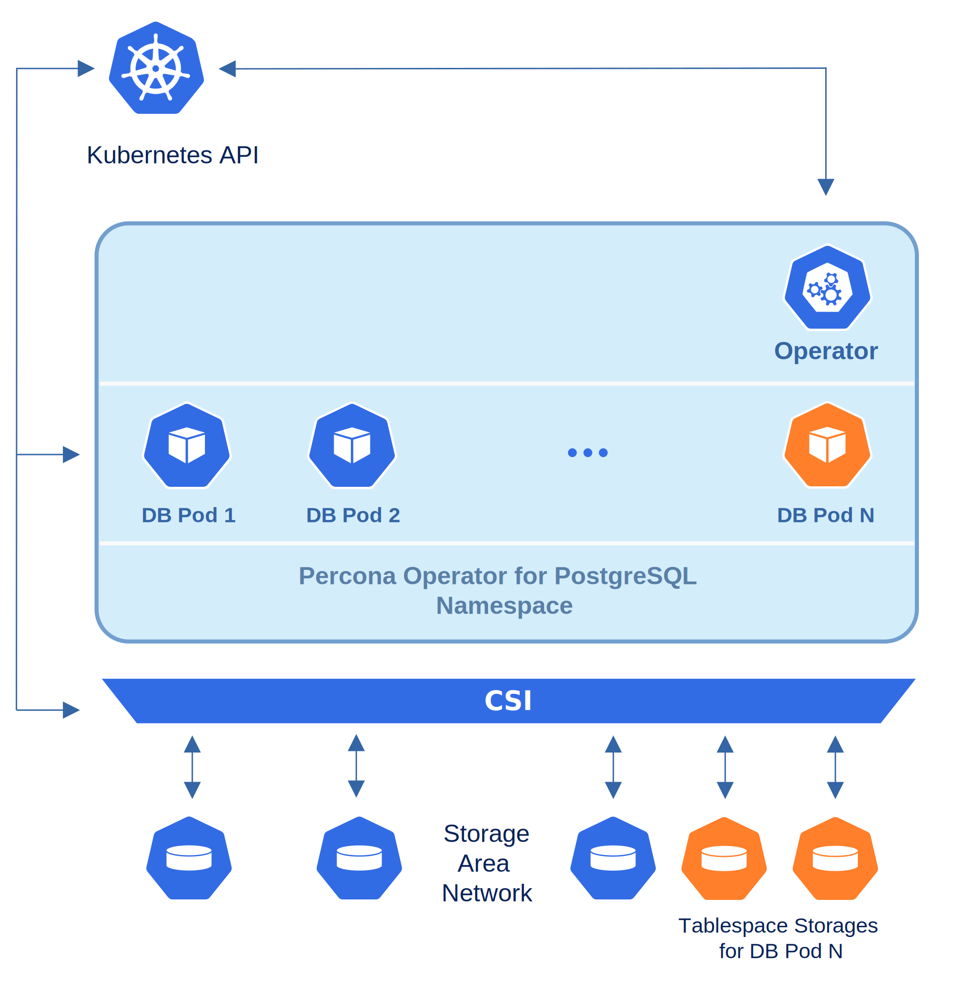

.. _howto-tablespace:

===========================================================
|operator| single-namespace and multi-namespace deployment 
===========================================================

Tablespaces allow DBAs to store a database on multiple file systems within the
same server and to control where (on which file systems) specific parts of the
database are stored. You can think about it as if you were giving names to your
disk mounts and then using those names as additional parameters when creating
database objects.

PostgreSQL supports this feature, allowing you to
*store data outside of the primary data directory*, and |operator| is a good
option to bring this to your Kubernetes environment when needed.

Possible use cases
-------------------

The most obvious use case for tablespaces is performance optimization. You place
appropriate parts of the database on fast but expensive storage and engage
slower but cheaper storage for lesser-used database objects. The classic example
would be using an SSD for heavily-used indexes and using a large slow HDD for
archive data.

Of course, the Operator :ref:`already provides<operator-constraints>` you with
`traditional Kubernetes approaches <https://kubernetes.io/docs/concepts/scheduling-eviction/assign-pod-node/>`_
to achieve this on a per-Pod basis (Tolerations, etc.). But if you would like to
go deeper and make such differentiation at the level of your database objects
(tables and indexes), tablespaces are exactly what you would need for that.

Another well-known use case for tablespaces is quickly adding a new partition to
the database cluster when you run out of space on the initially used one and
cannot extend it (which may look less typical for cloud storage). Finally, you
may need tablespaces when migrating your existing architecture to the cloud.

Each tablespace created by Percona Operator for PostgreSQL corresponds to a
separate Persistent Volume, mounted in a container to the ``/tablespaces``
directory.

Creating a new tablespace
--------------------------

Providing a new tablespace for your database in Kubernetes involves two parts:

#. Configure the new tablespace storage with the Operator,
#. Create database objects in this tablespace with PostgreSQL.

The first part is done in the traditional way of Percona Operators, by modifying
Custom Resource via the ``deploy/cr.yaml`` configuration file. It has a special
:ref:`spec.tablespaceStorages<operator-tablespacestorages-section>` section with
subsections names equal to PostgreSQL tablespace names.

The example already present in ``deploy/cr.yaml`` shows how to create tablespace
storage named ``lake`` 1Gb in size with dynamic provisioning (you can see
`official Kubernetes documentation on Persistent Volumes <https://kubernetes.io/docs/concepts/storage/persistent-volumes/>`_ for details):

.. code:: yaml

   spec:
   ...
     tablespaceStorages:
       lake:
         volumeSpec:
           size: 1G
           accessmode: ReadWriteOnce
           storagetype: dynamic
           storageclass: ""
           matchLabels: ""

After you apply this by running the ``kubectl apply -f deploy/cr.yaml`` command,
the new ``lake`` tablespace will appear within your database. Please take into
account that if you add your new tablespace to the already existing PostgreSQL
cluster, it may take time for the Operator to create Persistent Volume Claims
and get Persistent Volumes actually mounted.

Now you can append ``TABLESPACE <tablespace_name>`` to your ``CREATE`` SQL
statements to implicitly create tables, indexes, or even entire databases in
specific tablespaces (of course, your user should have appropriate ``CREATE``
privileges to make it possible).

Let’s create an example table in the already mentioned ``lake`` tablespace:

.. code:: sql

   CREATE TABLE products (
       product_sku character(10),
       quantity int,
       manufactured_date timestamptz)
   TABLESPACE lake;

It is also possible to set a default tablespace with the
``SET default_tablespace = <tablespace_name>;`` statement. It will affect all
further ``CREATE TABLE`` and ``CREATE INDEX`` commands without an explicit
tablespace specifier, until you unset it with an empty string.

As you can see, |operator| simplifies tablespace creation by carrying on all
necessary modifications with Persistent Volumes and Pods. The same would not be
true for the deletion of an already existing tablespace, which is not automated,
neither by the Operator nor by PostgreSQL.

Deleting an existing tablespace
-------------------------------

Deleting an existing tablespace from your database in Kubernetes also involves
two parts:

* Delete related database objects and tablespace with PostgreSQL,
* Delete tablespace storage in Kubernetes.

To make tablespace deletion with PostgreSQL possible, you should make this
tablespace empty (it is impossible to drop a tablespace until
*all objects in all databases using this tablespace* have been removed).
Tablespaces are listed in the ``pg_tablespace`` table, and you can use it to
find out which objects are stored in a specific tablespace. The example command
for the ``lake`` tablespace will look as follows:

.. code:: sql

   SELECT relname FROM pg_class WHERE reltablespace=(SELECT oid FROM pg_tablespace WHERE spcname='lake');

When your tablespace is empty, you can log in to the
*PostgreSQL Primary instance* as a *superuser*, and then execute the
``DROP TABLESPACE <tablespace_name>;`` command.

Now, when the PostgreSQL part is finished, you can remove the tablespace entry
from the ``tablespaceStorages`` section (don’t forget to run the
``kubectl apply -f deploy/cr.yaml`` command to apply changes).

However, Persistent Volumes will still be mounted to the ``/tablespaces``
directory in PostgreSQL Pods. To remove these mounts, you should edit
*all Deployment objects* for ``pgPrimary`` and ``pgReplica`` instances in your
Kubernetes cluster and remove the ``Volume`` and ``VolumeMount`` entries related
to your tablespace.

You can see the list of Deployment objects with the kubectl ``get deploy``
command. Running it for a default cluster named ``cluster1`` results in the
following output:

.. code:: text

   NAME                            READY   UP-TO-DATE   AVAILABLE   AGE
   cluster1                        1/1     1            1           156m
   cluster1-backrest-shared-repo   1/1     1            1           156m
   cluster1-pgbouncer              3/3     3            3           154m
   cluster1-repl1                  1/1     1            1           154m
   cluster1-repl2                  1/1     1            1           154m
   postgres-operator               1/1     1            1           157m

Now run ``kubectl edit deploy <oblect_name>`` for ``cluster1``,
``cluster1-repl1``, and ``cluster1-repl2`` objects consequently. Each command
will open a text editor, where you should remove the appropriate lines, which
in case of the ``lake`` tablespace will look as follows:

.. code:: yaml

   ...
   spec:
       ...
       containers:
         - name: database
           ...
           volumeMounts:
             - name: tablespace-lake
               mountPath: /tablespaces/lake
       volumes:
         ...
         - name: tablespace-lake
           persistentVolumeClaim:
             claimName: cluster1-tablespace-lake
         ...

Finishing the edit causes Pods to be recreated without tablespace mounts.
